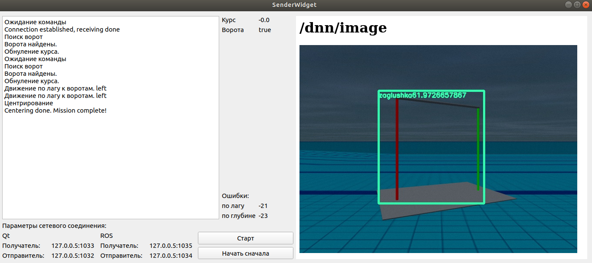
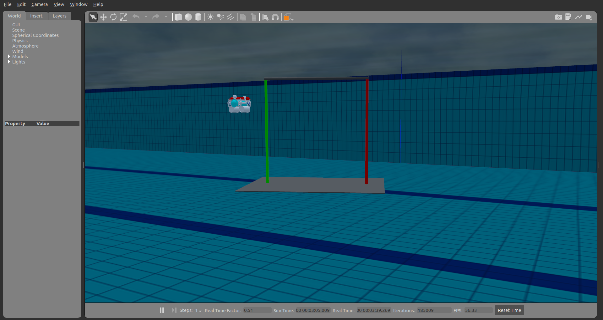

# Магистрский проект по курсу Qt от Екатерины Гаврилиной (Ляминой) МГТУ им Баумана
Выполнил: Плотников ВА, 4 семестр, кафедра СМ11

**[Презентация проекта](https://github.com/vladushked/masters_qt_project/blob/master/presentation.pdf)**

**[Видео-демонстрация интерфейса](https://disk.yandex.ru/i/JG8PA_jVmuyTsA)**

## Зависимости
- qt
- ros noetic
- [Форк симулятора Гидронавтики](https://github.com/vladushked/AUV-ROV_simple_simulator)
- [Форк репозитория sauvc Гидронавтики, ветка gate](https://github.com/vladushked/sauvc/tree/gate)

## Описание 

В проекте реализован интерфейс с использованием фреймворка Qt для тестирования системы управления (СУ) АНПА Кусто 3 и нейросетевого алгоритма поиска ворот на изображении. Симулятор Gazebo используется как источник данных для нейросети. В симуляторе реализована сцена с бассейеном и воротами.

**Интерфейс Qt**

**Сцена в симуляторе**

## Структура:

- Распознавание нейросетью ворот оформлено в ROS ноду. Нода получает изображения с виртуальной камеры, затем прогоняет через нейросеть MobileNet v2 и публикует координаты обнаруженных на изображении ворот в ROS топик 
- Qt интерфейс связывается по UDP с другой ROS нодой и передает ей текущее состояние СУ. В свою очередь эта ROS нода передает в симулятор Gazebo состояние СУ и отправляет обратно координаты ворот по UDP в Qt интерфейс
- Алгоритм поиска ворот реализован на стороне Qt интерфейса с помощью конечных автоматов QStateMachine